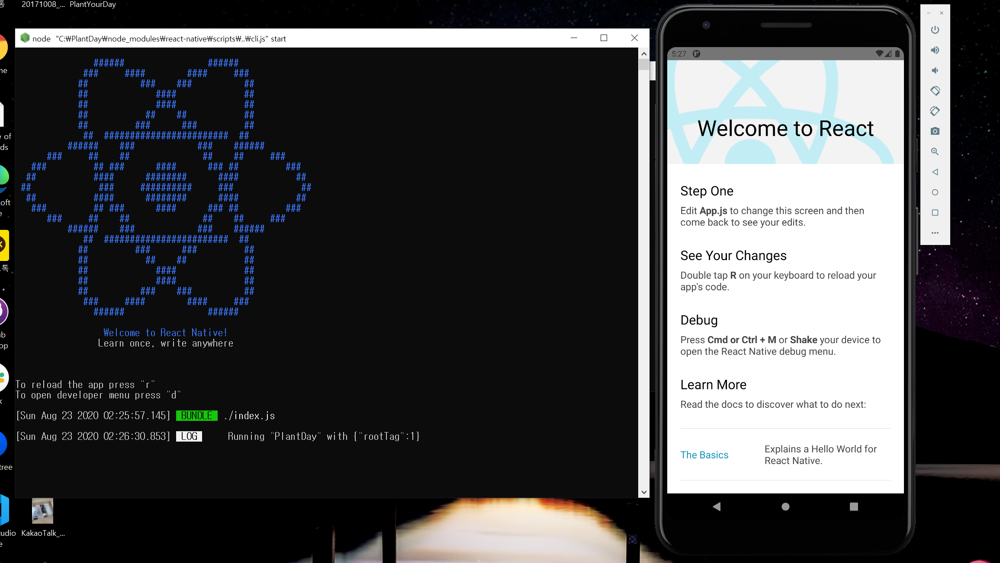

# 개발일지 1

리액트로 할지, 플러터로 할지, 웹뷰로 할지, 리액트 네이티브로 고민할지 시간만 보내다가 결국 ReactNative로 선택!!!

> ## 윈도우 개발환경 세팅

스무디 한 잔 마시며 끝내는 React Native를 참고(BJPUBLIC 출판사/ 김정헌)

1. 초코렛티 설치

https://chocolatey.org/

```
Set-ExecutionPolicy Bypass -Scope Process -Force; [System.Net.ServicePointManager]::SecurityProtocol = [System.Net.ServicePointManager]::SecurityProtocol -bor 3072; iex ((New-Object System.Net.WebClient).DownloadString('https://chocolatey.org/install.ps1'))
```
로 설치하라 되어있으나 
`'Set-ExecutionPolicy'은(는) 내부 또는 외부 명령, 실행할 수 있는 프로그램, 또는
배치 파일이 아닙니다.`라는 오류가 나서 구글링 통해
```
@"%SystemRoot%\System32\WindowsPowerShell\v1.0\powershell.exe" -NoProfile -InputFormat None -ExecutionPolicy Bypass -Command "iex ((New-Object System.Net.WebClient).DownloadString('https://chocolatey.org/install.ps1'))" && SET "PATH=%PATH%;%ALLUSERSPROFILE%\chocolatey\bin"
```
로 설치

2. 노드 설치
```
choco install nodejs-lts

node --version

npm --version
```
3. 파이썬 설치: 리액트 네이티브의 빌드 시스템은 파이썬에 의존하고 있기 때문에
```
choco install -y python2

python --version
```
4. 자바 개발 킷 설치
```
choco install -y jdk8

java -version

javac -version
```

5. 리액트 네이티브 CLI 설치

이 부분도 expo로 할 지 리액트 네이티브 CLI로 할 지 고민했으나, 결국 리액트 네이티브 CLI를 통해 하기로 결정했다.

이유는 순수 리액트 네이티브 해보고 싶어서!
```
npm install -g react-native-cli

react-native --version
```

6. 안드로이드 스튜디오 설치
- SDK Manager를 선택하여 오른쪽 하단의 Show Package Details를 통해 타깃으로 개발할 SDK 버전을 선택하고 다운로드
- 책 기준: 안드로이드 9.0
```
Android SDK Platform 28
Intel x86 Atom System Image
Google APIs Intel x86 Atom System Image
Google APIs Intel x86 Atom_64 System Image
```
- 안드로이드 스튜디오의 환경 변수 설정
  - ANDROID_HOME 추가
  - Path에도 추가
  - cmd에서 adb를 쳐서 결과 나오면 성공

> ## 계획 수정
첫 주에 생각해보면 원대한(?) 목표를 세웠으나 작게 시작해서 우선 성공시키고, 하나 하나 기능을 덧붙여 나가는 게 동기부여가 될 것 같았다.`(어려우면 빠르게 포기하는 내 자신을 알기에,,,)`

따라서 계획 수정은 다음과 같다.
1. 한 페이지 내에서 단순 버튼을 통해 기록하는 페이지 만들기
   - 우선 목표명 없음
   - 날짜마다 네모칸 추가 기능
   - 버튼 눌렀을 경우만 색 칠해짐
2. 색 변경 기능 추가, 목표명 변경 가능, 새로운 목표명 추가

이후 계획은 다음 주차에 기록

> ## 앱 개발 시작
1. 리액트 네이티브 프로젝트 생성
- 노드 패키지 매니저를 통해 설치하는 라이브러리, 모듈들의 버전을 고정하기 위해 다음의 명령어 사용
```
npm config set save-exact=true
```
- 리액트 네이티브 CLI사용
```
react-native init PlantDay
```

- 확인
```
npm run android
```

아래와 같은 작업들이 터미널을 통해 확인됨
```
info Running jetifier to migrate libraries to AndroidX. You can disable it using "--no-jetifier" flag.
Jetifier found 967 file(s) to forward-jetify. Using 8 workers...
info Starting JS server...
info Launching emulator...
info Successfully launched emulator.
info Installing the app...
Downloading https://services.gradle.org/distributions/gradle-6.2-all.zip

Welcome to Gradle 6.2!

Here are the highlights of this release:
 - Dependency checksum and signature verification
 - Documentation links in deprecation messages
 - Shareable read-only dependency cache

For more details see https://docs.gradle.org/6.2/release-notes.html

Starting a Gradle Daemon (subsequent builds will be faster)
```

