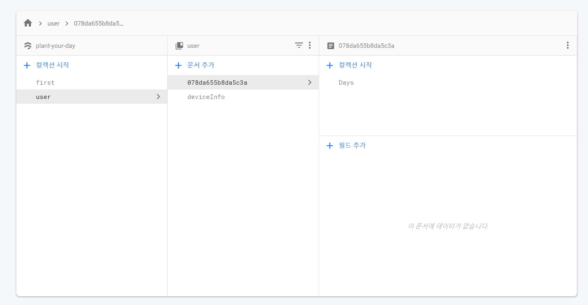

# ## 프로젝트 진척상황 공유6 (minj0i) - 2020-11-1
- 생각한 로직은 어느정도 구현됐으나 세세한 부분이 아직 부족
- 광고 붙이기 아직 진행 안됨

> ### 프로젝트 진척상황
* device Info 받아서 첫 시작과 저장 후 분기 처리 후 다른 화면 렌더링
* device Info 들어감에 따라 DB 구조 변경

* 이전DB 구조

* 현재DB 구조

> ### 이번주 목표(TO DO)
* CRUD
* 광고 
* 디자인
