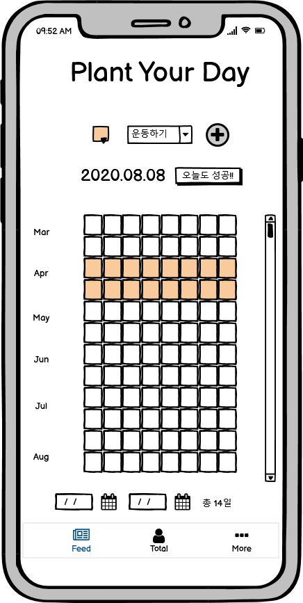
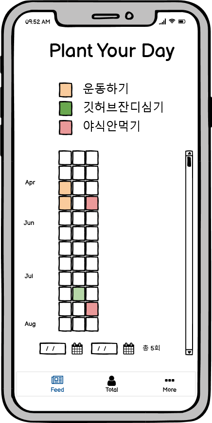
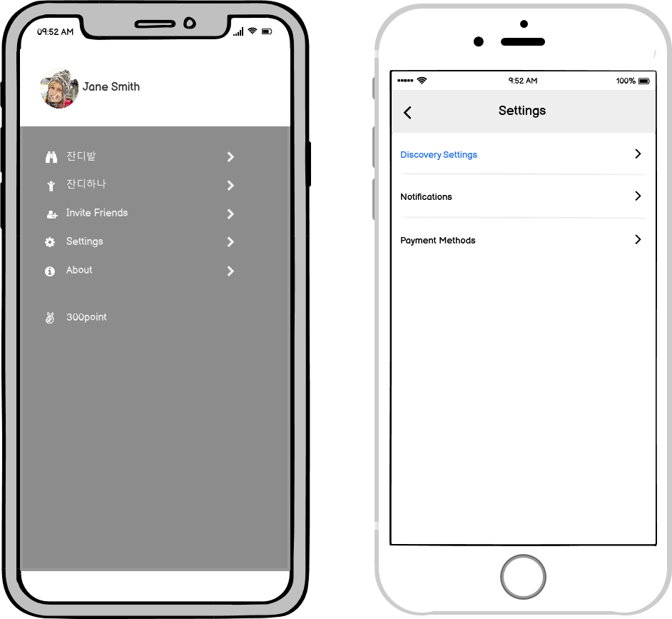
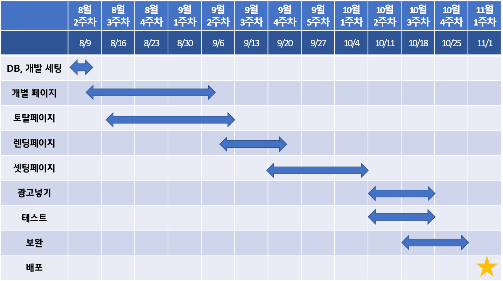

# PlantYourDay
 react로 하는 개인 project

## 개요
Git의 잔디심기처럼 자신이 목표한 '무언가'의 성취를 기록하는 앱으로
자신의 의지를 하루 하루 색을 칠하며 심어보세요!

### 사용법
1. 해당하는 날에만 기록할 수 있습니다. 오전 12시 00분 ~ 오후 11시 59분까지!
2. 목표 메뉴에서 + 버튼만 누르면 기록 끝!
3. 여러가지 목표를 세우고 목표별 색을 설정할 수 있어요
4. 설정한 전체 목표를 한 눈에 볼 수 있어요
5. 설정한 기간 내에 총 몇 회 기록했는지 볼 수 있어요

## 요구사항
- 네비게이션 메뉴
- 입력 데이터 저장 필요(항목별, 날짜별, 색)
- 시간받아서 칸 자동 늘어나기
- 추가 시 현재 날짜로 자동 입력
- 아이폰 사용자를 고려한 뒤로가기 버튼

## UI 설계

## Gantt Chart
